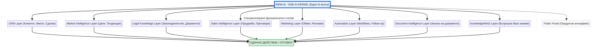

# REMI AI Architecture Blueprint 1.0

**Автор:** Manus AI  
**Дата:** Август 2026 г.  
**Статус:** Официален архитектурен документ  

---

## 1. Въведение и стратегическа визия

В съвременната екосистема от интелигентни бизнес решения съществува тенденция към раздробяване на функционалностите чрез множество независими изкуствени интелекти (напр. отделен AI за CRM, отделен за правни въпроси, отделен за маркетинг). Този подход води до разсипване на контекста, високи разходи за интеграция, противоречиви решения и липса на единообразна бизнес логика.

**REMI AI** налага радикално нова парадигма: **REMI AI Operating System**. В основата на тази архитектура стои идеята за **Единно AI ядро (One AI Kernel)**, което обединява цялата интелигентност в една централизирана, кохерентна система.

> „REMI AI е един централен AI Kernel, разширен чрез специализирани функционални и интелигентни слоеве. Слоевете не представляват отделни AI системи, а различни контексти, знания, инструменти и бизнес способности, които единният REMI AI използва според конкретната задача.“

---

## 2. Основно архитектурно разграничение

За да се избегне погрешно тълкуване на структурата на системата, архитектурният модел се дефинира чрез следните принципи:

| Неправилен подход ❌ | Архитектурен модел REMI AI ✅ |
| :--- | :--- |
| **AI 1** → CRM задачи | **ONE REMI AI (Централно ядро)** |
| **AI 2** → Правни въпроси | ├── **CRM Layer** (Клиенти, имоти, сделки, задачи) |
| **AI 3** → Маркетинг кампании | ├── **Market Layer** (Цени, тенденции, пазарен анализ) |
| **AI 4** → Пазарен анализ | └── **Legal Layer** (Законодателство, процедури) |
| *Резултат: Раздробеност и липса на връзка* | *Резултат: Единно вземане на решения и изпълнение на действия* |

**Публичният портал (Public Portal)** не е самостоятелен AI слой. Той представлява продуктов интерфейс и екосистемен компонент, който извлича своите възможности директно от REMI AI Kernel.

---

## 3. Архитектурна схема

Следната диаграма илюстрира йерархията и потока на данни в REMI AI Architecture:

---

## 4. Функционални и интелигентни слоеве

Слоевете в REMI AI не са независими агенти, а специализирани контексти, които ядрото динамично активира спрямо нуждите на потребителя:

1. **CRM Layer:** Управление на клиенти, портфолио от имоти, активни сделки и оперативни задачи.
2. **Market Intelligence Layer:** Анализ на пазарни цени, ценови тенденции, исторически данни и сравними имоти (comparables).
3. **Legal Knowledge Layer:** Интерпретация на законодателство, проверка на документи и правни процедури.
4. **Sales Intelligence Layer:** Стратегии за продажби, управление на възражения, подкрепа при преговори и затваряне на сделки.
5. **Marketing Layer:** Автоматично генериране на обяви, маркетинг в социални мрежи и създаване на рекламни кампании.
6. **Automation Layer:** Изпълнение на follow-up процеси, автоматични известия, задачи и сложни бизнес workflows.
7. **Document Intelligence Layer:** Дълбок анализ, класификация и обработка на документи и договори.
8. **Knowledge / RAG Layer:** Сигурен и верифициран достъп до вътрешна база от знания и фирмени регламенти.

---

## 5. Заключение

Архитектурата на REMI AI с едно централно ядро (One AI Kernel) осигурява мащабируемост, сигурност, консистентност на данните и максимална прецизност при изпълнение на бизнес задачи. Този принцип позиционира REMI като истинска **AI Operating System** в сферата на недвижимите имоти и бизнес автоматизацията.

---

## Референции
- [1] Всички архитектурни принципи и концептуални модели са дефинирани в съответствие с изискванията за REMI AI Blueprint 1.0 (Август 2026).
